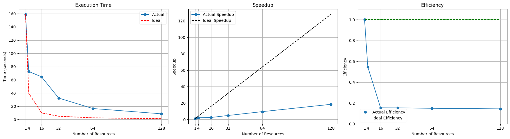
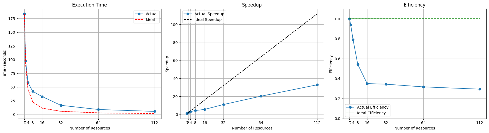
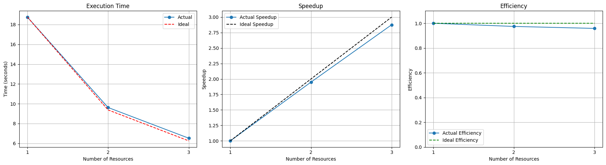
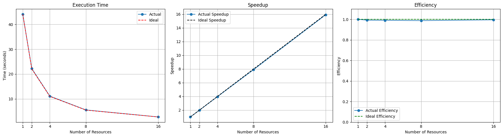
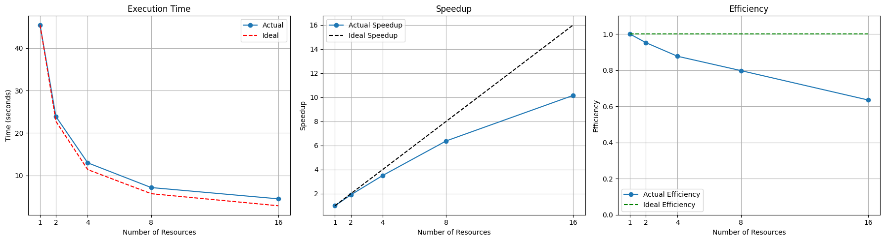
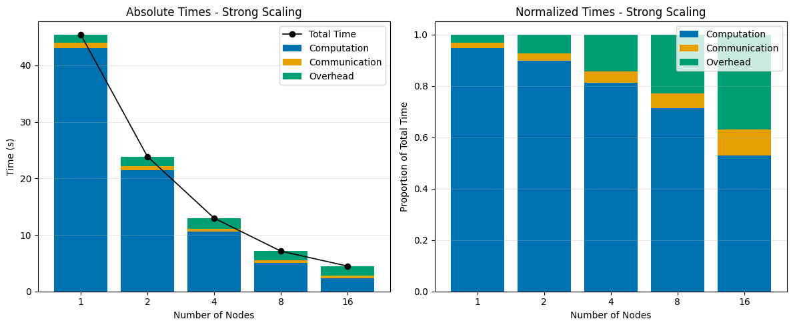
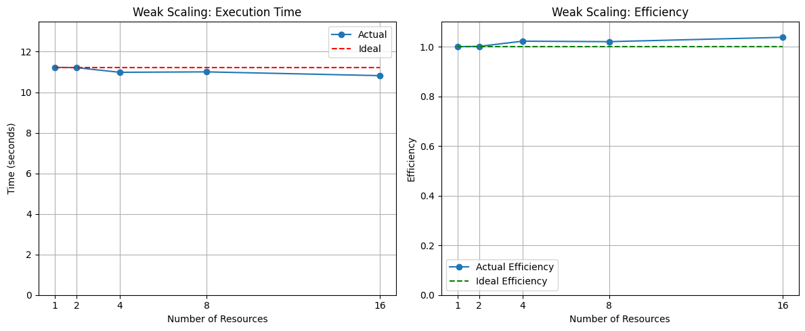
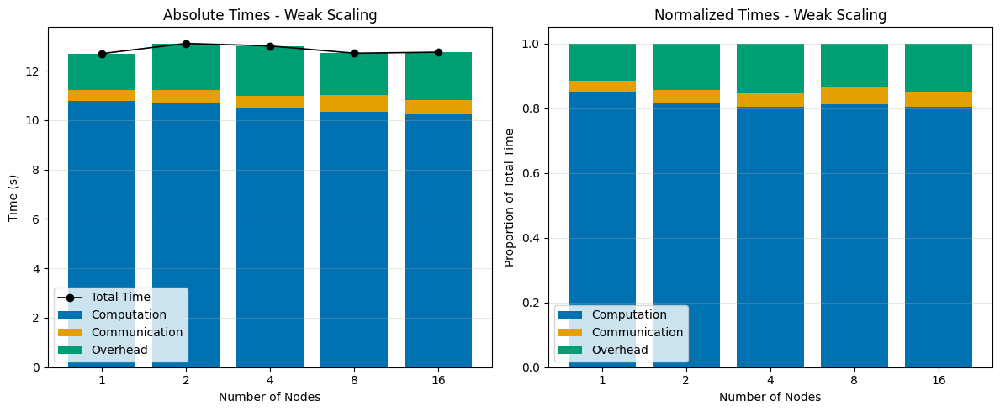
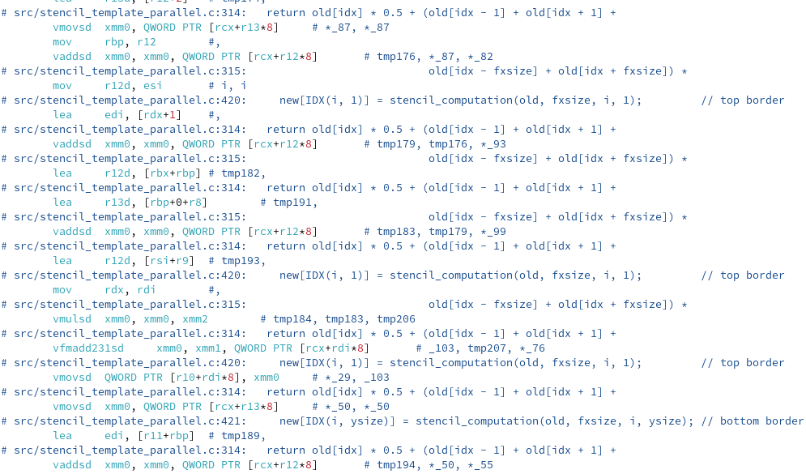

# The Stencil Method

Mersimoski Kjanija

---

# Parallelization of Heat Equation
 
- Stencil computation for 2D heat diffusion
- MPI --> domain decomposition
- Further optimization with OpenMP

---

# Serial

- 5 Point Stencil
- **Update rule**: weighted combination of self and neighbours
- Heat sources periodically inject energy
- **Naive solution**: double loop over all points $N$ times

---

# MPI

- Communication-computation **overlap**
- Non-blocking calls for neighbouring communication

---

# Overlap

```c++
inject_energy(...);

//...

fill_buffers(&planes[current], buffers, planes[current].size, neighbours);
perform_halo_comms(buffers, neighbours, &myCOMM_WORLD, reqs, planes[current].size);


update_inner_plane(&planes[current], &planes[!current]);

//...

MPI_Waitall(8, reqs, statuses);

copy_halo_data(&planes[current], buffers, planes[current].size, neighbours);
update_border_plane(periodic, N, &planes[current], &planes[!current]);
```

---

# Non Blocking Communications

```c++
void perform_halo_comms(buffers_t *buffers, int *neighbours, MPI_Comm *comm, MPI_Request *reqs, vec2_t size)
{
  for (uint i = 0; i < 8; i++)
  {
    reqs[i] = MPI_REQUEST_NULL;
  }

  if (neighbours[NORTH] != MPI_PROC_NULL)
  {
    MPI_Irecv(buffers[RECV][NORTH], size[_x_], MPI_DOUBLE, neighbours[NORTH], 0, *comm, &reqs[0]);
    MPI_Isend(buffers[SEND][NORTH], size[_x_], MPI_DOUBLE, neighbours[NORTH], 1, *comm, &reqs[1]);
  }

  if (neighbours[SOUTH] != MPI_PROC_NULL)
  {
    MPI_Irecv(...);
    MPI_Isend(...);
  }

  if (neighbours[EAST] != MPI_PROC_NULL)
  {//...
  }
  if (neighbours[WEST] != MPI_PROC_NULL)
  {//...    
  }
}
```

---

# OpenMP

```c++
#pragma omp parallel for collapse(2) schedule(static)
  for (uint j = 2; j <= ysize - 1; j++)
    for (uint i = 2; i <= xsize - 1; i++)
      new[IDX(i, j)] = stencil_computation(old, fxsize, i, j);
```

```c++
#pragma omp parallel for schedule(static)
  for (uint j = 1; j <= ysize; j++)
  {
    new[IDX(1, j)] = stencil_computation(old, fxsize, 1, j);         // left border
    new[IDX(xsize, j)] = stencil_computation(old, fxsize, xsize, j); // right border
  }

#pragma omp parallel for schedule(static)
  for (uint i = 1; i <= xsize; i++)
  {
    new[IDX(i, 1)] = stencil_computation(old, fxsize, i, 1);         // top border
    new[IDX(i, ysize)] = stencil_computation(old, fxsize, i, ysize); // bottom border
  }
```

---

# OpenMP

```c++
#pragma omp parallel for reduction(+ : totenergy) collapse(2) schedule(static)
    for (int j = 1; j <= ysize; j++)
        for (int i = 1; i <= xsize; i++)
            totenergy += data[IDX(i, j)];
```

--- 

## Vectorization

```c
#pragma omp parallel for
  for (uint j = 2; j <= ysize - 1; j++)
  {
    uint i = 2;
    for (; i <= simd_end; i += simd_width) // SIMD loop
    {
      __m256d center = _mm256_loadu_pd(&old[IDX(i, j)]);
      __m256d left = _mm256_loadu_pd(&old[IDX(i - 1, j)]);
      __m256d right = _mm256_loadu_pd(&old[IDX(i + 1, j)]);
      __m256d up = _mm256_loadu_pd(&old[IDX(i, j - 1)]);
      __m256d down = _mm256_loadu_pd(&old[IDX(i, j + 1)]);

      __m256d res = _mm256_add_pd(_mm256_mul_pd(center, _mm256_set1_pd(0.5)),
                                  _mm256_mul_pd(_mm256_add_pd(_mm256_add_pd(left, right),
                                                              _mm256_add_pd(up, down)),
                                                _mm256_set1_pd(0.125)));
      _mm256_storeu_pd(&new[IDX(i, j)], res);
    }

    for (; i <= xsize - 1; i++)
      new[IDX(i, j)] = stencil_computation(old, fxsize, i, j);
  }
```

---

# Threads Scaling - Orfeo



---

# Threads Scaling - Leonardo



--- 

# Strong Scaling

- Nodes: 1, 2, 4, 8, 16

- Tasks per node: 8
- CPUs per task: 14

DGCP: 2x56 cores per node.

---





---

# Strong Scaling - Total time



---

# Time spent doing...



---

# Weak Scaling

- Nodes: 1, 2, 4, 8, 16

- Tasks per node: 8
- CPUs per task: 14

$$
x=y=x_0\times\sqrt{\frac{\text{nt}}{\text{nt}_0}}
$$

Where $\text{nt}_0=8$ and $x_0=y_0=15000$

---

# Weak Scaling - Total time



---

# Time spent doing...



---

# Troubleshooting 

- man
- Davide's plot
- GDB
- Assembly

---

# Davide's plot


---

# GDB

```bash
mpicc -o maindebug -Iinclude src/stencil_template_parallel.c -g
mpiexec -np 2 gnome-terminal --wait -- gdb -x ./gdb_commands ./maindebug
```

Initial frequent problem: *segmentation fault*.
Solved by: backtracing (`bt` command inside of `gdb`)

---

# Assembly

```bash
mpicc -O3 -march=native -fopenmp -S -fverbose-asm -masm=intel -Iinclude src/stencil_template_parallel.c -o stencil.s
```



---

# Other possible approaches

- adasd
- sadasd